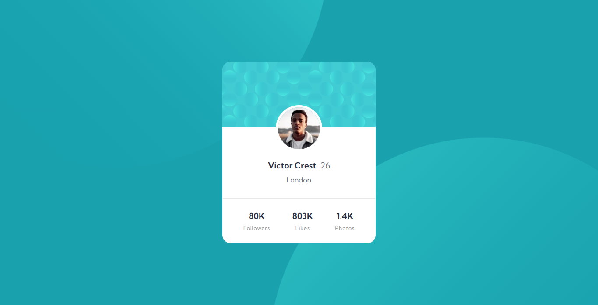

# Profile Card Component

<!-- TODO: add netlify deploy status badge -->

This is a solution to the [Profile card component challenge on Frontend Mentor](https://www.frontendmentor.io/challenges/profile-card-component-cfArpWshJ). Frontend Mentor challenges help you improve your coding skills by building realistic projects.

## Screenshot

## Links

<!-- TODO: update links -->

- [Live Site URL](https://profile-card-0x.netlify.app)
- [View Solution on Frontend Mentor](https://your-solution-url.com)
